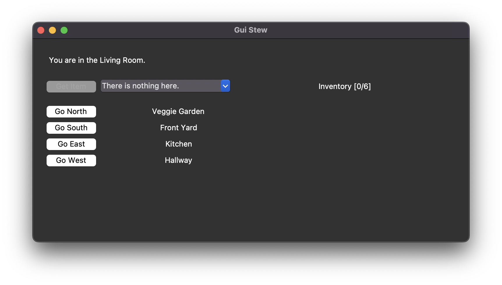
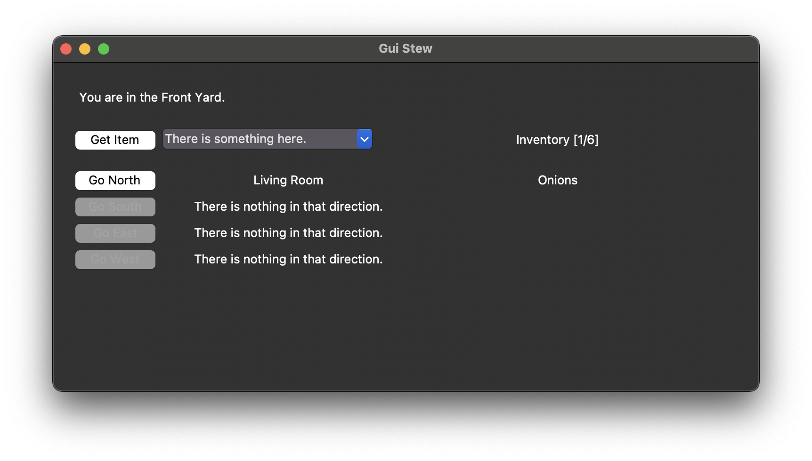
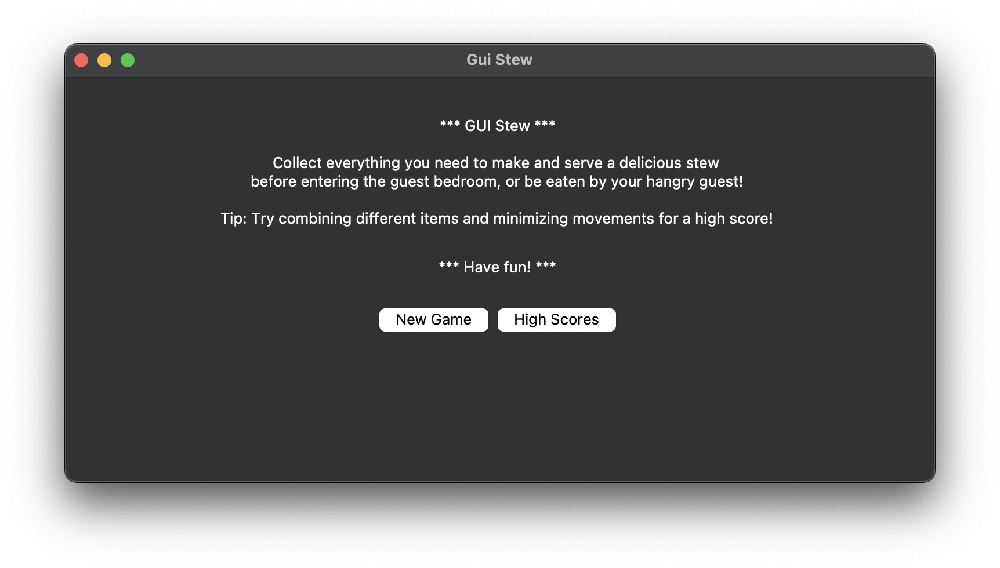
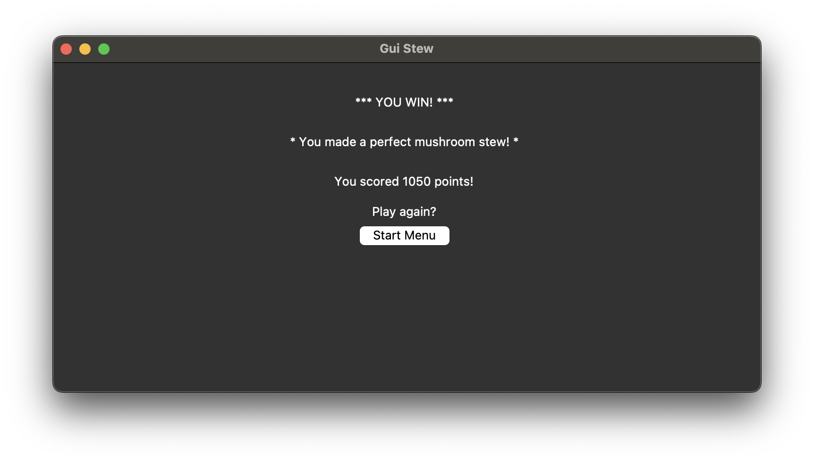
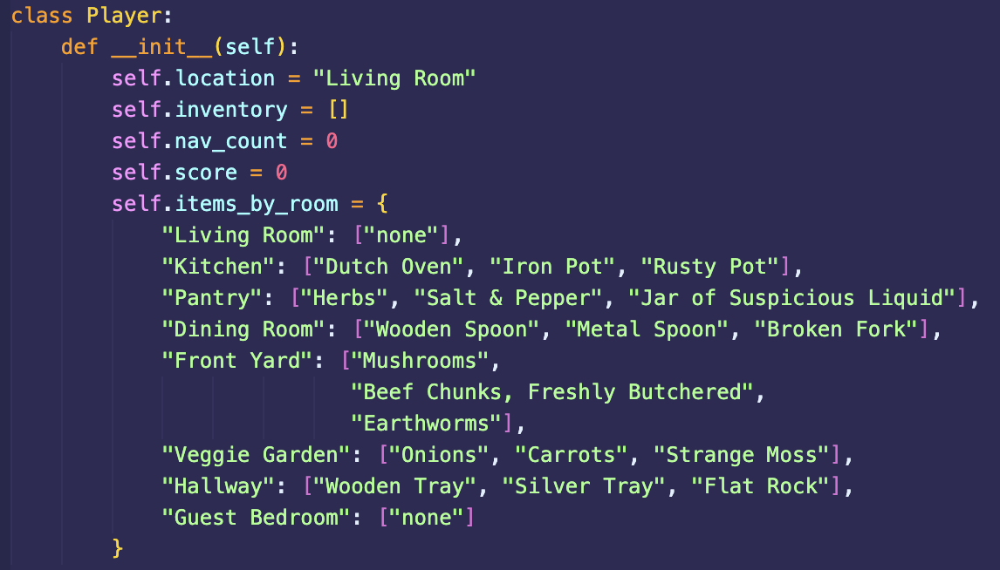
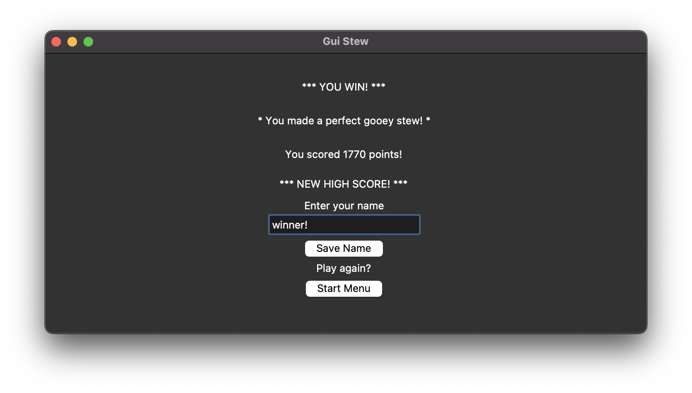
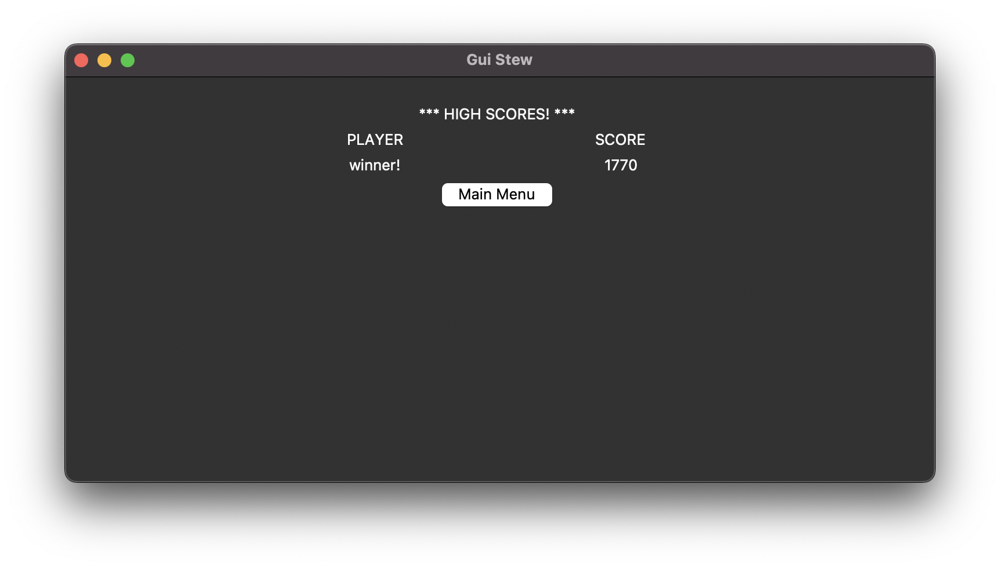

<!DOCTYPE html>
<html>
    <head>
        <meta charset="UTF-8">
        <meta name="viewport" content="width=device-width, initial-scale=1.0">
        <link rel="stylesheet" href="style.css">
        <title>Taryn Brownfield CS 499 Capstone</title>
    </head>
    <body>
        

            

                
                    <h1 class="lowercase">Taryn_Brownfield: </h1>
                
                

                    <h2 class="lowercase">CS-499 Capstone ePortfolio</h2>
                

            

        

        

            

                

                    <h3 class="lowercase">> Contact _</h3>
                    
e-mail: <a href="mailto:tarynbrownfield@gmail.com">tarynbrownfield@gmail.com</a>

                    
github: <a href="https://github.com/taryn-at-snhu">taryn-at-snhu</a>

                    
linkedin: <a href="https://www.linkedin.com/in/tarynbrownfield/">in/tarynbrownfield</a>

                

                

                    <h3 class="lowercase">> Navigate _</h3>
                    <ul>
                        <li><a href="#about">about me</a></li>
                        <li><a href="#education">education</a></li>
                        <li><a href="#artifact">the artifact</a></li>
                        <li><a href="#codereview">artifact code review</a></li>
                        <li><a href="#enhancements">enhancements</a></li>
                        <li><a href="#software">_ software design and engineering</a></li>
                        <li><a href="#algorithms">_ algorithms and data structures</a></li>
                        <li><a href="#databases">_ databases</a></li>
                        <li><a href="#final">the final product</a></li>
                    </ul>
                

            

            

                
<h3 class="lowercase">> About Me _</h3>

                

                    Hello! My name is Taryn. Since 2020, I have been working for NASA at Johnson Space Center as a Training Systems Operator/System Analyst. I grew up watching Star Trek reruns, and dreaming of one day working at NASA. During the COVID pandemic, that same passion for space and learning led me to begin tinkering with some simple coding projects. I discovered that I really enjoy programming, which led me to pursuing a C.S. degree at SNHU. I have enjoyed my time in the C.S. program, particularly this capstone class and my class on embedded systems, where I got to build a smart thermostat using a Raspberry Pi.
                

                
<h3 class="lowercase">> Education _</h3>

                

                    I attended Texas A&M from 2013-2017 and graduated with a B.S. in Aerospace Engineering and minors in Mathematics and Astrophysics. I began attending SNHU in the fall of 2022 to pursue a second B.S. in Computer Science with a focus in Software Engineering. While at SNHU, I maintained a 4.0, and was named to the President's List. <a href="https://meritpages.com/tarynbrownfield">Check out my SNHU Merit page here.</a>
                

                

                    

                        
                    

                    

                        
                    

                

                
<h3 class="lowercase">> The Artifact _</h3>

                

                    For my capstone course, I chose to enhance a simple text-based game in three key areas: Software Design and Engineering, Algorithms and Data Structures, and Databases. The text-based game was written in Python and came from an earlier course at SNHU, IT-140. I selected this artifact to enhance because I enjoyed making it, and I thought it would be a good candidate to enhance in all three categories. Gameplay consists of navigating around a small static map and gathering items before entering a final room, which ends the game. The game is played in the terminal, using text commands such as "Go North" and "Get mushrooms" to navigate and pick up items. If the player gathers all six necessary items before entering the final room, they win. If they enter the final room without all six items, they lose.
                

                
<h3 class="lowercase">> Artifact Code Review _</h3>

                <iframe width="750" height="422" src="https://www.youtube-nocookie.com/embed/D1qkROLIjUw?si=9rm-CzsxEK6T6FGD" title="YouTube video player" frameborder="0" allow="accelerometer; autoplay; clipboard-write; encrypted-media; gyroscope; picture-in-picture; web-share" referrerpolicy="strict-origin-when-cross-origin" allowfullscreen></iframe>

                
<h3 class="lowercase">> Enhancements _</h3>

                
<h4 class="lowercase">>> Software Design and Engineering</h4>

                

                    To enhance the artifact in this category, I designed and built a simple GUI. At first, the GUI only had one page: the game play page. On this screen, the player's current location is shown, along with the players inventory, and then five buttons. The first is the "Get Item" button, which allows the user to select one of three items (if applicable, as not all rooms have items) and add it to their inventory. The next four buttons are "Go" buttons that allow the player to navigate to an adjacent room to the North, South, East, or West. If no item is available to get, or no room is in a given direction, the buttons are grayed out and unclickable.
                

                

                    

                        

                            
                        

                        

                            
                        

                        <a class="prev" onclick="plusSlides(-1, 0)">&#10094;</a>
                        <a class="next" onclick="plusSlides(1, 0)">&#10095;</a>
                    

                

                

                    After developing the main game play GUI, I went on to create a start menu screen, a game over screen (multiple, actually, depending on whether the player wins or loses and whether a new high score is achieved), and a screen to view high scores.
                

                

                    

                        
                    

                

                
<h4 class="lowercase">>> Algorithms and Data Structures</h4>

                

                    In order to demonstrate my skills with algorithms and data structures, I decided to significantly complicate gameplay. Rather than simply grabbing every item the player can encounter, I decided to create three item options for each room that contains an item. The player can select one item only from each item-containing room. Then, I added a scoring algorithm. Certain items are worth different point values, and items combine differently to add a multiplier to the player's base score. There is an additional bonus for a player gathering items from only one of the three item lists, which include Mushroom Stew, Beef Stew, and Gooey Stew (a play on GUI). If a player gathers a random smattering of items from two or more lists, they make a motley stew and point modifiers are determined based on how many items from each list they gathered. However, if a player gathers all six items from one list, they get a "perfect stew" bonus. Finally, players are penalized for navigating around the game unnecessarily. The game can be completed in a minimum of 12 moves, and any moves after that begin acruing penalty points.
                

                

                    

                        

                            
                        

                        

                            
                        

                        <a class="prev" onclick="plusSlides(-1, 1)">&#10094;</a>
                        <a class="next" onclick="plusSlides(1, 1)">&#10095;</a>
                    

                

                

                    Additionally, I had to significantly restructure my code. This restructuring was driven by a few factors. First, my initial code did not adhere to any particular coding standards. The final product, however, adheres to the <a href="https://peps.python.org/pep-0008/">PEP-8 Style Guide for Python Code</a>. Also, the inclusion of a GUI necessitated restructuring so that I could run Tkinter's mainloop, rather than have the main body of the game play inside a while loop. And finally, in order to avoid the global variables I had been using while developing the code, I created two classes: Player and Game_Info.
                

                
<h4 class="lowercase">>> Databases</h4>

                

                    For the last enhancement, I decided to include a database where players could record their names and high scores. Only up to 10 entries are recorded, so if the 11th player scores higher than any of the previous 10 games, the lowest scoring record is replaced with the new high score. For this database, I used SQLite to implement the database, since Python has built-in SQLite functionality.
                

                

                    

                        

                            
                        

                        

                            
                        

                        <a class="prev" onclick="plusSlides(-1, 2)">&#10094;</a>
                        <a class="next" onclick="plusSlides(1, 2)">&#10095;</a>
                    

                

                
<h3 class="lowercase">> The Final Product _</h3>

                

                    I am proud to present GUI Stew, a simple game where a player gathers the items necessary to create a hearty (or somewhat revolting) stew for their hungry-enough-to-eat-you guest.
                

                

                    <a href="https://github.com/taryn-at-snhu/cs-499.git">Check out the GitHub repository here.</a>
                

                <iframe width="750" height="422" src="https://www.youtube-nocookie.com/embed/LChzAd9QBFA?si=hAqN-Bl8xDpSIpgV" title="YouTube video player" frameborder="0" allow="accelerometer; autoplay; clipboard-write; encrypted-media; gyroscope; picture-in-picture; web-share" referrerpolicy="strict-origin-when-cross-origin" allowfullscreen></iframe>
            

        

        
        
    </body>
</html>
